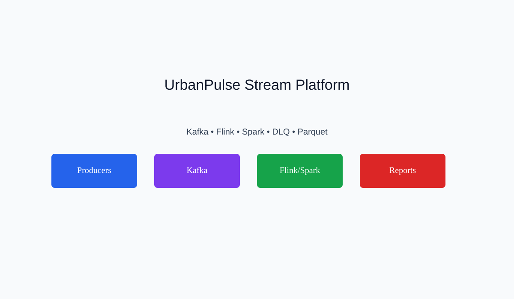

# UrbanPulse Stream Processing & Analytics Platform

BITS Pilani WILP — DSE ZG556 Stream Processing & Analytics assignment submission.

UrbanPulse ingests bus GPS, traffic signals, air quality, and smart meter events through Kafka. Flink detects incidents in real time; Spark produces ward energy summaries and health advisories; Parquet and Kafka sink outputs support reporting and recovery.

---

## System Architecture

Below is the visual overview of the UrbanPulse stream processing architecture, illustrating data flows from telemetric sources, through Kafka brokers, to real-time engines, analytical databases, and visual outputs:



---

## Repository Structure

```
spa_assignment/
├── architecture/     Design docs, readiness checklists, and diagrams
├── config/           Shared constants, Kafka and logging configuration
├── data/             Static CSV inputs and Parquet outputs
├── docker/           Docker Compose and streaming-runner image
├── kafka/            Topic administration
├── producers/        Telemetry producers with DLQ validation
├── consumers/        DLQ logger and priority consumer groups
├── streams/          Stream-table join enrichment worker
├── flink/            Real-time incident detection
├── spark/            Structured Streaming analytics jobs
├── reports/          PDF deliverables, DLQ reports, evidence
├── screenshots/      Architecture overview visuals
├── scripts/          Helper scripts (cleanup, topic creation, sampling)
├── tests/            Unit tests
├── logs/             Runtime logs (gitignored, regenerated)
└── checkpoints/      Spark checkpoints (gitignored, regenerated)
```

## Prerequisites

- Python 3.11+
- Docker Desktop
- Java 17+ (for Spark/Flink locally)

## Setup

1. Copy environment template and install dependencies:

```bash
cp .env.example .env
python3 -m venv .venv && source .venv/bin/activate
pip install -r requirements.txt
```

2. Start the Kafka cluster:

```bash
./scripts/start_kafka.sh
# or: cd docker && docker compose up -d
```

3. Create topics:

```bash
python3 kafka/create_topics.py
# or: ./scripts/create_topics.sh
```

> [!NOTE]
> **PySpark Version Compatibility**: The Spark Structured Streaming scripts (`ward_analytics.py` and `health_advisory.py`) dynamically resolve and download the correct `spark-sql-kafka-0-10` package version match based on your local `pyspark` installation, ensuring smooth local execution across PySpark v3 and v4.

## Run Components

Run each component in a separate terminal after Kafka is healthy.

| Component | Command |
| --- | --- |
| Bus GPS producer | `python3 producers/bus_gps_producer.py` |
| Air quality producer | `python3 producers/aq_producer.py` |
| Smart meter producer | `python3 producers/meter_producer.py` |
| Traffic producer | `python3 producers/traffic_producer.py` |
| DLQ logger (120s) | `python3 consumers/dlq_logger.py --duration 120` |
| Enrichment worker | `python3 streams/enrichment_worker.py` |
| High-priority consumer | `python3 consumers/priority_consumers.py --mode high` |
| Standard consumer | `python3 consumers/priority_consumers.py --mode standard` |
| Flink incident detector | `python3 flink/incident_detector.py` |
| Spark ward analytics | `python3 spark/ward_analytics.py` |
| Spark health advisory | `python3 spark/health_advisory.py` |
| Sample incidents | `python3 scripts/consume_incidents.py --count 5` |

For Flink/Spark inside Docker:

```bash
docker exec -it streaming-runner bash
export KAFKA_BOOTSTRAP_SERVERS=kafka1:9092,kafka2:9092,kafka3:9092
python3 flink/incident_detector.py
```

## Kafka Topics

- `urbanpulse.bus_gps` — Bus GPS telemetry (6 partitions, 24h retention)
- `urbanpulse.traffic_signals` — Traffic signal events (3 partitions, 7d retention)
- `urbanpulse.air_quality` — Air quality readings (2 partitions, 90d retention)
- `urbanpulse.smart_meters` — Smart meter readings (4 partitions, 365d retention)
- `urbanpulse.incidents` — Flink-detected incidents (2 partitions, 30d retention)
- `urbanpulse.health_advisories` — Spark health warnings (2 partitions, 14d retention)
- `urbanpulse.ward_energy_summary` — Ward energy aggregates (3 partitions, 30d retention)
- `urbanpulse.dlq` — Dead-letter queue (2 partitions, 14d retention)
- `urbanpulse.bus_gps_enriched` — Enriched GPS stream (2 partitions, 24h retention)

## Outputs

- **DLQ reports:** `reports/dlq_report.md`, `reports/dlq_report.csv`, `reports/dlq_report_bar.png`, `reports/dlq_report_pie.png`, and `reports/dlq_report.pdf`
- **Parquet:** `data/ward_energy_summary/` (Ward energy summaries generated by Spark)
- **Evidence:** `reports/evidence.md`, `reports/incident_samples.jsonl` (Incident samples from Flink)
- **Assignment PDFs:** `reports/task_a.pdf`, `reports/task_b.pdf`, `reports/task_c.pdf`

## Testing

```bash
pytest tests/ -v
```

## Cleanup

Remove generated caches, logs, and checkpoints:

```bash
./scripts/cleanup.sh
```

## Docker Services

| Service | Port | Purpose |
| --- | --- | --- |
| kafka1 | 19092 | Kafka broker (external) |
| kafka2 | 29092 | Kafka broker (external) |
| kafka3 | 39092 | Kafka broker (external) |
| kafka-ui | 8080 | Cluster monitoring UI |
| streaming-runner | — | Flink/Spark execution environment |

## Architecture Documentation

Detailed documentation and comparative studies are located in the `architecture/` directory:

1. **[Architecture Design Report](architecture/architecture.md) ([PDF](architecture/architecture.pdf))** — High-level platform layout, storage layer justifications (PostGIS, TimescaleDB, InfluxDB), and component mapping.
2. **[Flink vs Spark Comparison](architecture/flink_vs_spark.md)** — In-depth trade-off analysis of real-time stream processing engines regarding latency, state backend recovery, and checkpointing.
3. **[Lambda vs Kappa Architectures](architecture/lambda_vs_kappa.md) ([PDF](architecture/lambda_vs_kappa.pdf))** — Explores data pipelines layout and justification of batch-streaming hybrid layout vs purely event-driven architecture.
4. **[Production Readiness Checklist](architecture/readiness_checklist.md) ([PDF](architecture/readiness_checklist.pdf))** — Operations verification checklist covering logging, data partitioning, scaling, and fault tolerance.

## Future Improvements

- Grafana dashboards for live monitoring
- REST API for advisory and incident lookup
- Automated DLQ replay workflow

